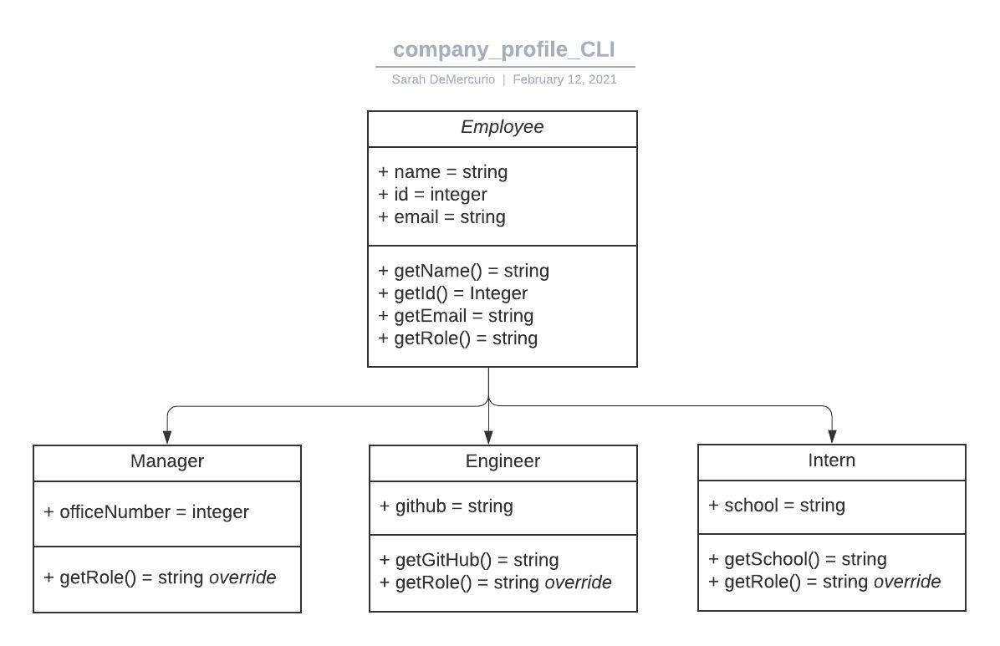
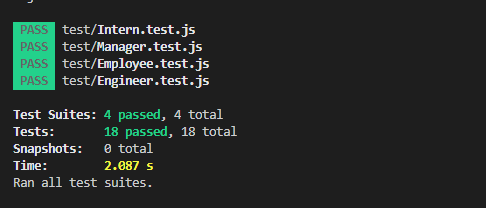

# company_profile_CLI
OOP: Team profile generator

## Classes:
The application includes ```Employee```, ```Manager```, ```Engineer```, and ```Intern``` classes. The latter three child classes extend from the parent class ```Employee```. These child classes will inheret the properties ```name```, ```id```, and ```email```, along with their methods.

Each child class possesses their own unique property and method in conjunction with those inherited from the parent class.



## Testing
Unit tests are written for each class, ensuring each test passes. The initial tests are designed to fail at first until the most simple code is written to get the tests to pass. 



Once initial tests have passed, code will then be refactored to deliver a solid, functioning app.